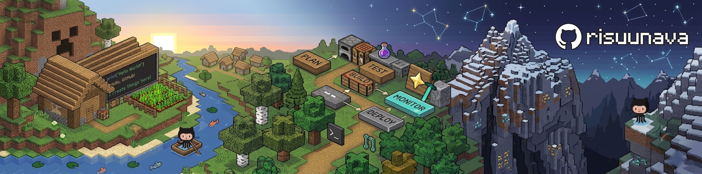

# Muhammad Lazuardi Al-Farisi

Full Stack Software Engineer, Tech Enthusiast

[GitHub](https://github.com/risuunava)  |  [Portfolio](https://portofolio-risu.vercel.app/)  |  [Google Skills](https://www.skills.google/public_profiles/6a6ee609-c84c-47ab-a562-ec7f58fb4490)

## About

Full Stack Software Engineer with expertise in building scalable web applications and IoT solutions. Specialized in system architecture, machine learning integration, and innovative problem-solving.

## Tech Stack

Web PHP, Laravel, JavaScript, TypeScript, React, Next.js, Tailwind CSS

Mobile Flutter, Dart, Capacitor

Backend and Database MySQL, PostgreSQL, Supabase, Firebase

ML and Security Python, NLP, scikit-learn, LLM security

IoT Arduino, ESP8266, ESP32

Tools Git, Docker, Postman, Vercel

## Projects

### Helpdesk System Web

Full-stack IT helpdesk with ML-powered priority detection. Intelligent ticketing system with automated issue classification (87% accuracy), SLA tracking, and role-based access control.

Tech: Laravel 12, Next.js 16, Python ML, PostgreSQL
Status: Production Ready
[View Repository](https://github.com/risuunava/helpdesk-system-web)

### IT Support Report Management

Streamlined platform for managing IT support requests with efficient categorization and tracking.

Tech: Laravel, MySQL, Blade Templates
[View Repository](https://github.com/risuunava/sariater-it-support)

### Sentiment Analysis Public Service Reviews

Machine learning project analyzing Indonesian public service reviews using NLP for sentiment classification.

Tech: Python, TF-IDF, Logistic Regression
[View Repository](https://github.com/risuunava/analisis-sentimen-komentar)

## Competencies

**Backend Development**
REST APIs, database optimization, Laravel ecosystem

**Full Stack Integration**
Frontend frameworks (React, Vue, Next.js) with backend systems

**Machine Learning**
NLP, sentiment analysis, data processing and classification

**System Architecture**
Scalable design patterns, microservices, API development

**IoT Systems**
Embedded systems, hardware integration, real-time processing

## Education

Universitas Sebelas April
Computer Science / Informatics
Sumedang, West Java, Indonesia

## Connect

Open for collaboration, freelance projects, and full-time opportunities.

[GitHub](https://github.com/risuunava)  |  [Email](risuunava@gmail.com)  |  [LinkedIn](https://www.linkedin.com/in/muhammad-lazuardi-al-farisi-63478940b)

